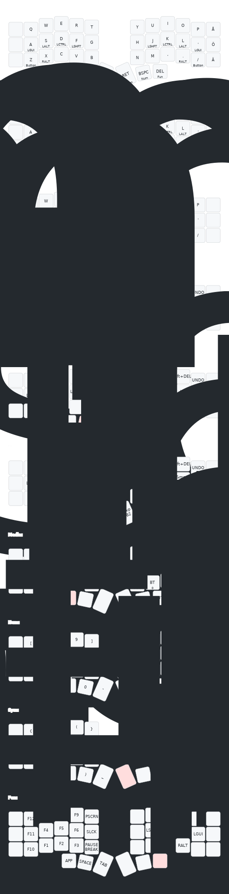

# ZMK Config

This repo contains a Corne ZMK config based on Miryoku.

Current layout:
- QWERTY Miryoku
- stock Miryoku layers, home-row mods, thumbs, and hold-taps
- intended host input source on macOS: `ABC - Extended`
- Swedish letters on the right outer column of the base layer:
  - top: `Å`
  - home: `Ö`
  - bottom: `Ä`
- `BSPC` keeps Miryoku's `Num` hold, but supports tap-then-hold repeat via a custom `quick-tap-ms`

Notes:
- `?` is on the normal US position: `Shift + /`
- the dedicated `Å/Ö/Ä` keys are implemented as macOS dead-key macros for `ABC - Extended`

**Layout Reference**

Generated SVG:



Source YAML for the drawing:

- `keymap-drawer/corne.yaml`

Importable KLE JSON starter for a single-keyboard reference sheet:

- `keymap-drawer/corne.kle.json`

**Regenerate The Layout Image**

Use `keymap-drawer`:

```bash
pipx install --python python3.12 keymap-drawer
```

Parse the keymap:

```bash
keymap parse -z config/corne.keymap -c 12 -o keymap-drawer/corne.yaml
```

Draw the Corne SVG using ZMK's 6-column Corne physical layout:

```bash
keymap draw \
  -d /path/to/zmk/app/dts/layouts/foostan/corne/6column.dtsi \
  -l foostan_corne_6col_layout \
  -o keymap-drawer/corne.svg \
  keymap-drawer/corne.yaml
```

Notes:
- the generated YAML may show Swedish host keycodes as punctuation legends
- if that happens, edit `keymap-drawer/corne.yaml` so the base layer shows `Å`, `Ö`, and `Ä`, then rerun `keymap draw`
- the current checked-in `keymap-drawer/corne.yaml` already has those labels corrected

**Generate KLE JSON**

The KLE JSON is a starting point for making a Miryoku-style single-keyboard reference in Keyboard Layout Editor:

```bash
~/.local/pipx/venvs/keymap-drawer/bin/python scripts/generate_kle_reference.py
```

Then import:

- `keymap-drawer/corne.kle.json`

into:

- https://www.keyboard-layout-editor.com/
